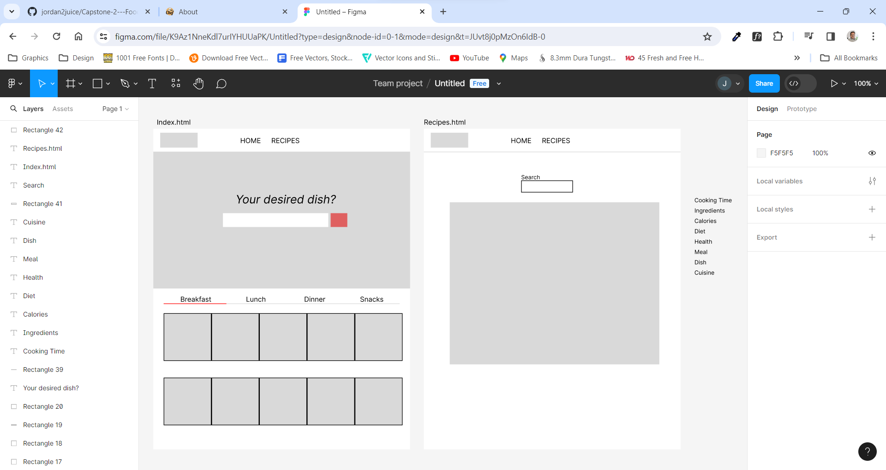
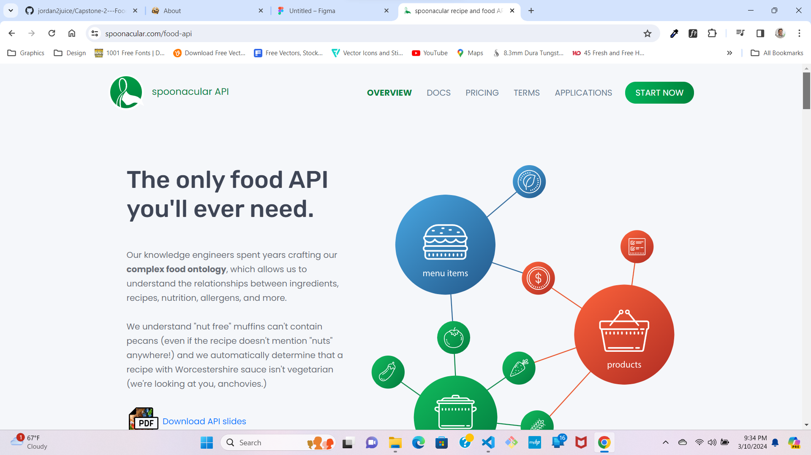

# Capstone 2 - Food Recipe Web Application

The following is an example of a food recipe web application that utilizes an API to create inspiration for the different types of resources that can be used to produce different types of food and recipes.

application is application is used for giving inspiration for different food recipes. The web application contains a list of different recipes ideas for the user to create and customize.

## Wireframe

The wireframe is my initial ideal and plan for the web application. The wireframe allows you to plan and stratagy your web application. The wireframe shows my recipe page and the concept of my home page.

## Techologies

The technology of the web application that was used to produce the web application is:

- HTML5, which provides a basic structure for the page;
- CSS3, which allows us to style the page and make it visually appealing;
- JavaScript, which adds interactivity to the page and allows you to customize the page based on user actions;
- SASS, which allows you to customize the page based on user actions and styles of the stylesheet;
- API, a data source for the web application that allows you to create and display different types of information for the web application.

## Features

1. Contact Form, which verifies the users information.
2. Dinner Search, which allows you to search for different types of food for inspiration.
   The search bar will display results as soon as you start typing in it.

## API Source

The API source that was used to create the web application is: [Spoonacular] https://spoonacular.com/. This API provided images and titles for the different types of food and possible recipes.

## Conclusion:

This project was fun and interesting to create. The intial idea for the web application came from a youtube video. This project required creating a website using HTML/CSS/Javascript and using information from an API.

The final design differs from the initial wireframe, but the essence of the web application is there. It has been designed with simplicity and functionality in mind and with features that can be used to create a web application. The web application will be able to display food inspiration with delicious dishes of food.
